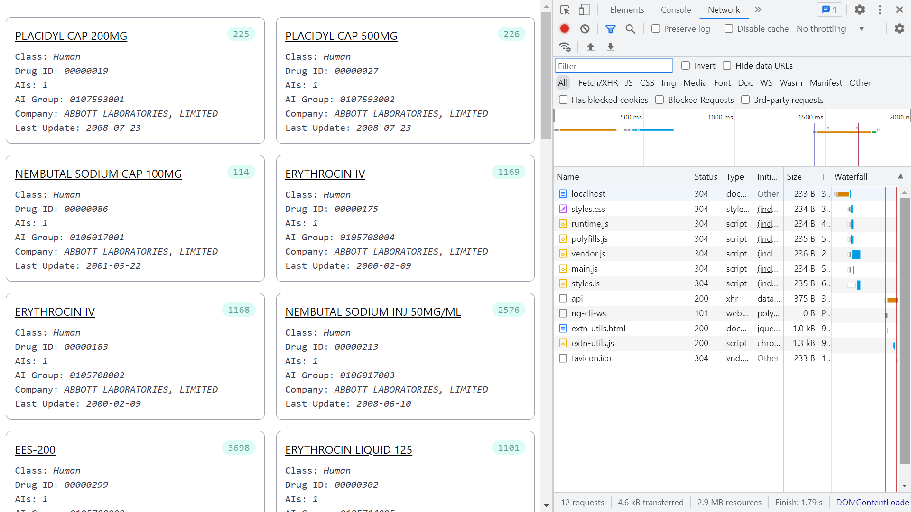

# :zap: Angular Tailwind Data Portal

* Angular app using [TailwindCSS](https://developers.google.com/chart/) components to create a simple frontend to display backend data
* **Note:** to open web links in a new window use: _ctrl+click on link_


## :page_facing_up: Table of contents

* [:zap: Angular Tailwind Data Portal](#zap-angular-tailwind-data-portal)
  * [:page\_facing\_up: Table of contents](#page_facing_up-table-of-contents)
  * [:books: General info](#books-general-info)
  * [:camera: Screenshots](#camera-screenshots)
  * [:signal\_strength: Technologies](#signal_strength-technologies)
  * [:floppy\_disk: Setup](#floppy_disk-setup)
  * [:wrench: Testing](#wrench-testing)
  * [:computer: Code Examples](#computer-code-examples)
  * [:cool: Features](#cool-features)
  * [:clipboard: Status \& To-Do List](#clipboard-status--to-do-list)
  * [:clap: Inspiration](#clap-inspiration)
  * [:file\_folder: License](#file_folder-license)
  * [:envelope: Contact](#envelope-contact)

## :books: General info

* Data shown on a grid of Tailwind-styled cards
* Any JSON data object made available on `localhost:3000` can be displayed on the Angular frontend. It is easy to modify the frontend Typescript model and HTML markup to match the JSON object on the backend. I used [drug product JSON data](https://health-products.canada.ca/api/drug/drugproduct/?lang=en&type=json) as test data - see `db.json`

## :camera: Screenshots



## :signal_strength: Technologies

* [Angular framework v15](https://angular.io/)
* [TailwindCSS v3](https://tailwindcss.com/) CSS framework
* [JSON server](https://www.npmjs.com/package/json-server) used to serve a fake REST API backend on port localhost:3000 to test frontend

## :floppy_disk: Setup

* Run `npm i` to install dependencies.
* This frontend requires a backend data source - see `/models/pharma.data.ts` for format, on port `http://localhost:3000`
* 'json-server --watch db.json' to run fake backend. Navigate to `http://localhost:3000/api` to see data object.
* Run `ng serve` for a dev server. Navigate to `http://localhost:4200/`. The app will automatically reload if you change any of the source files.

## :wrench: Testing

* Fake databse data in `db.json` used to test frontend.

## :computer: Code Examples

* 'data.service.ts' class with HTTP GET request that returns a response body of type PharmData array

```typescript
export class DataService {

  constructor(private http: HttpClient) { }

  getPharmaData(): Observable<PharmaData[]> {
    return this.http.get<PharmaData[]>(`${baseUrl}/api`)
  }
}
```

## :cool: Features

* Tailwind build for production CSS purge results in a very small styles bundle (about 7kB)

## :clipboard: Status & To-Do List

* Status: working
* To-Do: add navbar, pages...

## :clap: Inspiration

* [LogRocket: Types vs. interfaces in TypeScript](https://blog.logrocket.com/types-vs-interfaces-in-typescript/)
* [Gouv of Canada API: Drug Product Database - All Files - Drug Product](https://health-products.canada.ca/api/drug/drugproduct/?lang=en&type=json)

## :file_folder: License

* This project is licensed under the terms of the MIT license.

## :envelope: Contact

* Repo created by [ABateman](https://github.com/AndrewJBateman), email: gomezbateman@gmail.com
